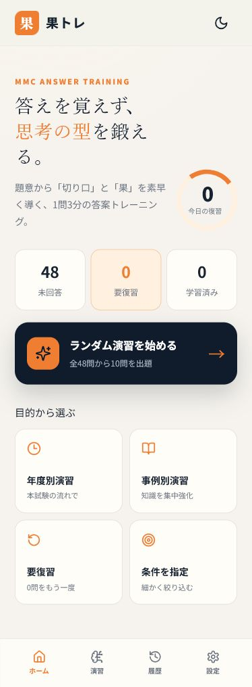
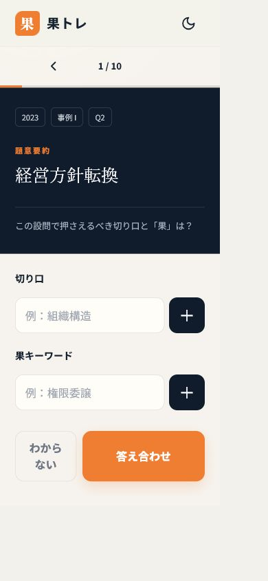

# 果トレ

中小企業診断士2次試験のMMCメソッドに基づき、本試験の設問文とMMC解説に明記された題意から「切り口」と「果キーワード」を想起する個人学習PWAです。問題・履歴・設定はすべて端末内に保存され、インターネット接続がない環境でも利用できます。

## 主な機能

- 2023〜2025年度、事例I〜IVの51回答単位を収録
- 本試験の設問文全文と、MMC解説に明記された題意を出題時に表示
- 字数制約を強調し、複数のMMC題意をタグで表示
- SWOT・小問・計算／記述の組合せは、採点単位ごとに「今回の回答対象」を明示して1問ずつ出題
- 年度・事例・未回答・要復習・出題数による絞り込み
- タグ形式の切り口／果キーワード入力
- 表記正規化・部分一致・同義語辞書を使った100点満点の採点
- 4段階の自己評価と復習指定
- 学習履歴、端末内保存、JSONバックアップ／復元
- 制限時間、同義語判定、ダークモード
- PWA、オフライン対応、スマートフォン優先UI

## サンプル画面

| ホーム | 演習 |
| --- | --- |
|  |  |

## セットアップ

Node.js 22.13以降を用意し、プロジェクト直下で次を実行します。

```bash
npm install
npm run dev
```

表示されたURLをブラウザで開きます。スマートフォンではブラウザの「ホーム画面に追加」からアプリのように起動できます。

## 確認とビルド

```bash
npm run test
npm run lint
npm run build
```

成果物は `dist/` に生成されます。ローカルで本番版を確認する場合は `npm run preview` を使います。

## GitHub Pagesへの公開

1. GitHub Desktopで変更内容を確認し、コミットして **Push origin** を実行します。
2. リポジトリの **Settings → Pages** を開き、Sourceを **GitHub Actions** にします。
3. **Actions** の「Deploy 果トレ to GitHub Pages」が緑のチェックになるまで待ちます。
4. `https://kds-yukimatz.github.io/mmc/` を開きます。以前の画面が残る場合は、ブラウザを再読み込みするか、ホーム画面のPWAを一度終了して開き直します。

公開処理は同梱の `.github/workflows/deploy.yml` が行います。Node.js 22とpnpm 11で依存関係を復元し、テスト済みの本番ビルドをGitHub Pagesへ配置します。

`vite.config.ts` は相対パスでビルドする設定のため、リポジトリ名にかかわらず配信できます。履歴は各端末のIndexedDBに保存されるため、公開しても他人と共有されません。

## 問題データの更新

アプリが読む正本は `public/data/kahotore_mmc_base_v2.json` です。更新時は同じ構造のJSONを作成し、`metadata.version` を上げます。アプリは起動時に問題データを更新し、`trainingResults` と `settings` は保持します。PWAは問題JSONをネットワーク優先で確認し、オフライン時は前回のキャッシュを利用します。

今回追加した主要項目は次のとおりです。

- `question_text`: 本試験問題PDFの設問文全文
- `group_id`: 同じ大問に属する回答単位をまとめるID
- `sub_question_no`: 設問1、設問2などの小問番号
- `answer_unit_label`: 画面に表示する今回の回答対象
- `mmc_theme`: MMC解説に明記された題意の配列
- `theme_status`: MMC題意の確認状態
- `theme_source_pages`: MMC解説の参照ページ
- `question_status`: 設問文の確認状態
- `question_source_pages`: 本試験問題の参照ページ
- `answer_status`: MMC模範解答の確認状態
- `answer_source_pages`: MMC模範解答の参照ページ

JSONではsnake_case、アプリ内部ではcamelCaseへ変換します。問題データ更新後は `npm run test` と `npm run build` を実行し、51件の件数と分割設問の対応を確認してください。新たに1対多へ分割する場合は `public/data/migration_map.json` も更新します。

## 学習履歴のバックアップ

設定画面の「履歴をエクスポート」でJSONを保存します。復元先の端末で「履歴をインポート」を選ぶと、既存履歴を残したままID単位で統合します。旧IDが1対1で対応する場合は新IDへ引き継ぎ、1対多への分割では、誤った複製を避けるため親`group_id`の「旧記録」として保存します。ブラウザのサイトデータを削除する前や端末変更前にエクスポートしてください。

## 設計

- `domain/`: 問題、回答履歴、採点結果の型
- `repositories/`: 問題取得・履歴永続化の境界
- `services/`: 正規化、同義語、採点
- `features/training/`: 演習セッションの状態
- `db/`: Dexie / IndexedDB

採点は `GradingService`、問題取得と履歴保存はRepositoryインターフェースを介します。AI意味採点やクラウド同期へ移行するときは、画面を大きく変えず実装を差し替えられます。

## 現在の採点

- 果キーワード: 60点（登録語に対する一致割合）
- 切り口: 25点（登録語に対する一致割合）
- 効果語: 15点（対象語1種類につき5点、上限15点）

入力はNFKC正規化、空白・記号除去、小文字化を行い、部分一致と同義語辞書を適用します。

## 未実装・拡張候補

- AIによる意味採点と採点理由
- SM-2等を使った間隔反復と「今日の復習」スケジュール
- 因キーワード、複数模範解答
- 分野別の弱点分析、CSV出力
- Firebase等による暗号化された端末間同期
- 問題編集UIとデータ検証ツール

## データについて

設問文は2023〜2025年度の中小企業診断士第2次試験問題PDFと正誤表を参照し、設問番号・条件・字数制約を目視確認しています。`mmc_theme` は提供された「MMC本試3年解答帖（組織・流通・生産・財務）」の記載を使用し、推測や言い換えはしていません。`question_summary` は従来どおり題意要約として残しています。

全件の監査内容は `outputs/audit_report.md`、分割・移行方針は `outputs/split_records.md` と `outputs/migration_map.json`、未確認項目は `outputs/unverified_records.md` に記録しています。
