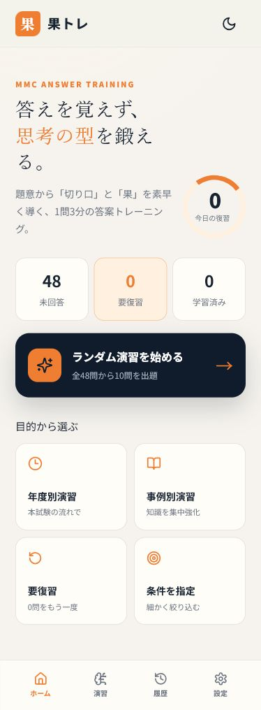
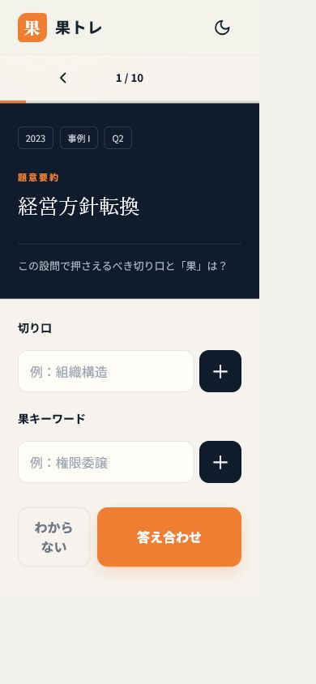

# 果トレ

中小企業診断士2次試験のMMCメソッドに基づき、本試験の設問文とMMC解説に明記された題意から「切り口」と「果キーワード」を想起する個人学習PWAです。問題・履歴・設定はすべて端末内に保存され、インターネット接続がない環境でも利用できます。

## 1分 × 好きなセット数

ホームは「今日」、下部メニューは「今日／教材／記録」です。「1分はじめる」から設定なしで題意・練習用の因を読み、頭の中で果を出して「答えを確認」。3択の自己判定を確定した時だけ記録します。目安60秒・最大2問で、1問だけでも終了できます。時間超過は誤答にしません。

教材は134概念・161小問、想起322問と使い分け12問の計334問です。設計上の必須は31項目（汎用性などから選定した24項目とAストック7項目）で、Bストック22件も非必須の小問として収録しています。MMC CS3/CS4/CS5/ME2/ME3の解説21本を根拠にした独自短問を計91問収録し、今回CS5〜ME3から58問を追加しました。原問題や原答案は転載せず、解説に基づいて汎用化しています。各事例IVは対象外です。MMC独自問題の頻度は本試験の出現数に加算せず、頻度は従来どおり2023〜2025年I〜IIIのverified44回答・32元設問group・165原語から集計しています。資料内の出現数、A/B重要度、必須への採用理由、本人の習熟は別に表示します。

通常開始は4枠サイクルで未確認・期限到来・使い分け・維持を選びます。新規上限は第1期6／第2期3／第3期以降0 mapping/日。「未確認から1セット」は上限と期を超えて必須を確認できます。安定には、ヒントなしで24時間以上空けた連続2回のfastと2種類以上のcueなどが必要です。安定は自己申告を含み、試験得点を予測しません。試験日は任意設定、未設定でも日本時間の21日プランを開始できます。

画面離脱は時間を停止し、再読込では同じ問題・ヒント・解答の表示状態を復元します。旧IndexedDBの4storeを保持したままv4へ移行し、新モード用4storeを追加。旧履歴から安定判定を生成しません。回答と出題枠は1トランザクションで確定し、連打・2タブでは重複しません。セット中の教材は開始時のsnapshotを使い、PWA更新は終了後の「更新する」で反映します。

設定のバックアップはv4で旧履歴・設定・私的教材・1分学習・抽象題意の履歴／再開状態を保存し、v2/v3も復元できます。v4は改修後の果トレで復元できます。同じIDの内容が違う場合は一覧を表示して無変更で停止します。初回オンライン準備後はオフラインで使えます。元の5練習モード、事例IV、私的教材、A/B29ストックは「教材→既存の練習」に残っています。Bストック22件は題意別の小問へ拡充済みです。

実行用教材の種と原語集計表は`scripts/micro-inputs/`、生成物は`public/data/micro-content-v1.json`です。MMC独自短問の出典にはファイル名・資料の年・ページ・設問を保持し、mmc2025Cs532x03kaisetu.pdfのようにファイル名の年と資料の年が異なる場合も両方記録します。元PDFやローカルパスは収録しません。MMC独自短問は「教材」から個別に開始でき、履歴は通常の1分練習と同じ学習記録へ保存します。`npm run content:validate`（build時にも実行）で本試頻度を再集計し、ID・出典・件数・対応の不整合を拒否します。Bストック22件と各果の出典対応も検査します。

`npm test`で既存機能・抽象題意grader・backup検証を確認します。`npm run abstraction:validate`は新sidecarの参照と内容を検査し、build時にも実行します。ブラウザ検証はPlaywrightとChromeを用意し、devを4173、previewを4174で起動して`npm run test:browser`と`npm run test:abstraction-browser`を実行します。`PLAYWRIGHT_MODULE`（モジュールパス）、`BROWSER_CHANNEL`、`DEV_URL`、`PREVIEW_URL`、`REPORT_PATH`、`SCREENSHOT_PATH`で検証環境と出力先を指定できます。既存スクリプトはmicroのDB移行・復元・PWAを、新スクリプトは抽象題意の出題・採点と320/360/390/430px表示を確認します。

## 主な機能

- CS512・522・532の再分析から汎用化した復習ストック29件（A必須7件／B推奨22件）
- 題意・トリガー一覧での復習ストック表示、A/B絞り込み、因→果・目的→施策での演習

復習ストックのA/Bは覚える優先度です。得点や本人の弱点を表すものではありません。個人の答案・添削・PDF・事例固有の商品名は収録せず、汎用的な因・目的と果の対応を学習メモとして収録しています。本試験の模範解答や過去問の頻出回数は変更していません。既に使えているB候補も復習用に含みます。

ホームの「A必須ストック」から因→果を練習でき、出題条件の「復習ストック」で全教材・追加ストック・A必須・B推奨を選べます。工場のあり方の2件は目的→施策に収録しています。

- 2023〜2025年度、事例I〜IVの51回答単位を収録
- 本試験の設問文全文と、MMC解説に明記された題意を出題時に表示
- 字数制約を強調し、複数のMMC題意をタグで表示
- SWOT・小問・計算／記述の組合せは、採点単位ごとに「今回の回答対象」を明示して1問ずつ出題
- 年度・事例・未回答・要復習・出題数による絞り込み
- タグ形式の切り口／果キーワード入力
- 表記正規化・部分一致・同義語辞書を使った100点満点の採点
- 4段階の自己評価と復習指定
- 学習履歴、端末内保存、JSONバックアップ／復元
- 制限時間、同義語判定、ダークモード
- PWA、オフライン対応、スマートフォン優先UI
- 年度・事例別の一覧モード（設問文・MMC題意・果キーワードの対応を出題順に表示）
- 一覧では果キーワードを設問ごとに開閉でき、確認後にMMC模範解答を二段階目として表示
- 過去3年分の果キーワード辞典（同じ果を使う設問を横断表示）
- 全事例／事例別の果キーワード頻出ランキング
- 個人用OCR教材JSONの端末内インポート（公開データとは分離）
- 「本試一問一答」「題意トレ」「棚から果トレ」「因→果」「目的→施策」の5モード切替
- 題意トレは「題意・与件のトリガー → 題意の棚」、棚から果トレは「題意の棚 → 果キーワード」を反復
- MMC 2026強化答練6事例（Cs411・Cs412・Cs421・Cs422・Cs431・Cs432）のsource付きトリガー辞書
- 題意・トリガー一覧で、トリガー／棚／果／出典を横断検索
- 回答後に正誤・苦戦理由・弱点タグを記録し、優先度順に弱点復習
- 「因→果」「目的→施策」モードと事例Ⅰ・Ⅲの重点プリセット
- 題意から棚と代表候補を想起する「題意 → 棚」「題意 → 果候補」の2練習
- 本試一問一答では企業概要と題意を見て切り口を先に答え、次に設問文を読んで果キーワードを答える二段階演習
- 事例・タグ別正答率、果キーワード不足／題意判断の別集計

## 弱点復習

ホームの「弱点復習」「事例Ⅰ重点」「事例Ⅲ重点」から始めます。条件画面で年度・事例・弱点タグ・前回不正解・前回時間がかかった・過去N回の低正答率・最近の間違い・未復習期間を組み合わせて絞り込めます。タグの選択肢同士はOR、異なる条件の間はANDです。未復習期間は30日、最近の間違いは14日、時間がかかった目安は180秒です。優先度の重みは `src/features/weakness/weaknessReview.ts` の `priorityWeights` で調整できます。

回答後には自動採点とは別に正誤を指定し、「果キーワードが出なかった」「思い出すのに時間がかかった」「題意の切り分けに迷った」を複数記録できます。タグは事例別の候補から選択するか自由に追加できます。記録したタグと履歴は端末内に保存され、バックアップJSONにも含まれます。旧バックアップも読み込めます。

「因→果」「目的→施策」は、今回提示された演習メモの具体例を `public/data/kahotore_weakness_practice_v1.json` に収録しています。候補のうち一つでも一致すれば自動採点上は正解です。表記揺れ・部分一致・登録済みの同義語を許容し、自動判定と異なる妥当解は回答後の正誤指定で補えます。演習メモはMMC原資料由来のレコードと出典を区別しています。

## 題意トレ・棚から果トレ

「本試一問一答」は年度・事例に固有の問題を扱います。最初に業種・事業概要と題意（必要に応じてフレームワーク）を表示し、切り口を入力した後に設問文と果キーワードの入力欄を表示します。「因→果」「目的→施策」は過去問の暗記を前提にしない汎用演習で、別の問題データと画面を使用します。

ホームと教材に「与件を読む前の練習」を追加しました。抽象題意だけを見て棚を入力し、果候補モードでは代表候補を3つまで想起します。通常6件と棚専用2件を収録し、元問題・模範解答は答え合わせ後に確認できます。与件依存の具体策を想起しなくても減点しません。

新graderは登録語・同義語・明示ルール・record固有の許容代替を使い、◎／○／△／×で評価します。3候補（coreが2件なら2候補）と全棚を想起すれば◎です。近隣候補は棚の認識として表示し、代表候補の得点へ重ねません。新履歴は旧5モード、1分学習、旧正答率集計から分けて保存します。

「未提示の題意チェック」は初見のtransfer表現を6件ずつ出題し、棚を確定してから果候補を入力します。既出表現と24時間間隔を記録します。アプリ内で初めて提示した題意表現への練習指標であり、本試験全般への効果を保証しません。

派生教材の正本は `public/data/kahotore_abstraction_v1.json` です。基礎v2の内容を変更せず、出典IDをsidecarで参照します。`npm run abstraction:validate` が出典・棚・候補数・variantを検査し、build時にも実行します。

本試一問一答の果は、最初の振り分け段階では一般的な候補で構いません。具体的な模範解答語と同じ方向の一般語は `src/data/generalFruitKeywords.ts` の明示的な対応で正解に含めます。1つの一般語で複数の果を埋めず、強みと不足など逆方向の回答も一致にしません。設定で「同義語・一般化判定」をオフにするとこの対応は使いません。事例Ⅳの数値・計算答案には一般化候補を設定していません。

ホームの「題意トレ」「棚から果トレ」、または演習条件画面の「トレーニング」から切り替えます。既存の本試一問一答は「本試一問一答」としてそのまま利用できます。

- **題意トレ**: 「交流」「部品削減」「見込生産」などのトリガーから、開くべき題意の棚を答えます。
- **棚から果トレ**: 「サービス」「設計」「生産管理」などの棚から、使える果キーワードを答えます。
- 年度・事例・学習状況・出題数の絞り込みは従来の5モードで共通です。
- 入力の正規化と同義語判定は、既存の採点処理を流用しています。

題意の棚は次の事例別構成です。

- 事例I: SWOT・強み／経営戦略／組織構造／人的資源管理／新事業・事業展開
- 事例II: SWOT・3C／ターゲット／情報発信／製品・品揃え／サービス／プロモーション／関係性マーケティング／協業
- 事例III: 強み／設計／生産管理／品質管理／情報管理／営業／技能承継／外注

題意・トリガー一覧は、ホームの「題意・果の辞典」または本試設問一覧上部のリンクから開きます。「本試3年／強化答練」、事例、検索語で絞り込み、トリガー・棚・果・出典を一画面で確認できます。

強化答練データの正本は `public/data/kahotore_trigger_dictionary_v1.json` です。各レコードは `source` と `source_type` を持ち、解答・解説で確認できた内容だけを収録しています。一般知識による補完は行っていません。既存の本試3年データは、`question_summary`、`answer_unit_label`、`mmc_theme`、`cuts`、`fruit_keywords` から題意検索用レコードを生成します。

## 一覧モード

下部メニューの「一覧」から開きます。年度と事例を選ぶと、回答単位へ分割された全設問が本試験の順序で並びます。前回選んだ年度・事例は同じ端末に保存されます。

果キーワードは初期状態ではすべて非表示です。「果キーワード」をタップすると、その設問だけを表示できます。さらに「MMC模範解答を見る」をタップすると、果キーワードをどのような文章で使うか確認できます。果キーワードを閉じると模範解答も閉じます。

「すべて表示」は果キーワードだけを一括表示し、模範解答は表示しません。「すべて隠す」または年度・事例の変更で、すべて初期状態に戻ります。一覧での開閉は採点・学習履歴・復習状態には影響しません。

一覧の最下部にも年度・事例の切替を用意しています。年度を変えても事例は維持され、事例を変えても年度は維持されます。通常の「次へ」は、同じ事例を新しい年度から古い年度へ確認し、最古年度まで進んだら次の事例の最新年度へ移動します。年度・事例の移動後は一覧先頭へ戻り、果キーワードと模範解答はすべて閉じた状態になります。

## 果キーワード辞典・頻出ランキング

ホームの「果キーワード辞典」、または一覧画面上部のリンクから開きます。

- **辞典**: 果キーワードを検索し、使われた年度・事例・設問を確認できます。
- **頻出ランキング**: 全事例または事例別に、同一設問内の重複を除いた出現回数順で表示します。

辞典・ランキングは `public/data/kahotore_mmc_base_v2.json` の `fruit_keywords` から画面表示時に生成します。辞典用データを別に保持しないため、問題データを更新すれば自動で反映されます。

表記ゆれを統合する必要が生じた場合だけ、`src/data/fruitKeywordAliases.ts` に「別表記: 正規表記」を追加します。意味が近いだけの語は統合せず、採点用の同義語辞書とは分けて管理します。

## 個人用MMC教材の読み込み

設定画面の「個人用MMC教材」から、専用JSONを読み込めます。教材はブラウザのIndexedDBだけに保存され、公開用の問題JSONやGitHubリポジトリには含まれません。同じ端末で新しい専用JSONを読み込むと、それまでの個人用教材を置き換えます。

OCR抽出直後のレコードは、一覧モードと果キーワード辞典で「個人用OCR未確認」と表示します。誤認識を正解として採点しないため、`answer_status` が `unverified` の個人用レコードはランダム演習と条件指定演習から除外します。内容を原本と照合し、`verified` に変更したレコードだけが演習対象になります。

個人用教材を消す場合は、設定画面の「個人用教材を削除」を使います。標準問題と学習履歴は残ります。教材PDF・専用JSONは個人学習の範囲で管理し、公開・再配布しないでください。

## サンプル画面

| ホーム                                                 | 演習                                                     |
| ------------------------------------------------------ | -------------------------------------------------------- |
|  |  |

## セットアップ

Node.js 22.13以降を用意し、プロジェクト直下で次を実行します。

```bash
npm install
npm run dev
```

表示されたURLをブラウザで開きます。スマートフォンではブラウザの「ホーム画面に追加」からアプリのように起動できます。

## 確認とビルド

```bash
npm run test
npm run lint
npm run build
```

成果物は `dist/` に生成されます。ローカルで本番版を確認する場合は `npm run preview` を使います。

## GitHub Pagesへの公開

1. GitHub Desktopで変更内容を確認し、コミットして **Push origin** を実行します。
2. リポジトリの **Settings → Pages** を開き、Sourceを **GitHub Actions** にします。
3. **Actions** の「Deploy 果トレ to GitHub Pages」が緑のチェックになるまで待ちます。
4. `https://kds-yukimatz.github.io/mmc/` を開きます。以前の画面が残る場合は、ブラウザを再読み込みするか、ホーム画面のPWAを一度終了して開き直します。

公開処理は同梱の `.github/workflows/deploy.yml` が行います。Node.js 22とpnpm 11で依存関係を復元し、テスト済みの本番ビルドをGitHub Pagesへ配置します。

`vite.config.ts` は相対パスでビルドする設定のため、リポジトリ名にかかわらず配信できます。履歴は各端末のIndexedDBに保存されるため、公開しても他人と共有されません。

## 問題データの更新

アプリが読む正本は `public/data/kahotore_mmc_base_v2.json` です。更新時は同じ構造のJSONを作成し、`metadata.version` を上げます。アプリは起動時に問題データを更新し、`trainingResults` と `settings` は保持します。PWAは問題JSONをネットワーク優先で確認し、オフライン時は前回のキャッシュを利用します。

題意トリガー辞書は `public/data/kahotore_trigger_dictionary_v1.json` です。強化答練の追加時は、`trigger`、`shelf`、`fruit_keywords`、`source`、`source_type` を原資料と照合して追加し、辞書の `metadata.version` を更新してください。

今回追加した主要項目は次のとおりです。

- `question_text`: 本試験問題PDFの設問文全文
- `business_context`: 答えを含めない簡潔な業種・事業概要
- `framework`: 3C、SWOTなどの思考枠組み。ない場合は省略
- `cuts`: 答案を構成する切り口。SWOTの分割設問では回答対象の要素のみを保持
- `group_id`: 同じ大問に属する回答単位をまとめるID
- `sub_question_no`: 設問1、設問2などの小問番号
- `answer_unit_label`: 画面に表示する今回の回答対象
- `mmc_theme`: MMC解説に明記された題意の配列
- `theme_status`: MMC題意の確認状態
- `theme_source_pages`: MMC解説の参照ページ
- `question_status`: 設問文の確認状態
- `question_source_pages`: 本試験問題の参照ページ
- `answer_status`: MMC模範解答の確認状態
- `answer_source_pages`: MMC模範解答の参照ページ

JSONではsnake_case、アプリ内部ではcamelCaseへ変換します。問題データ更新後は `npm run test` と `npm run build` を実行し、51件の件数と分割設問の対応を確認してください。新たに1対多へ分割する場合は `public/data/migration_map.json` も更新します。

## 学習履歴のバックアップ

設定画面の「履歴をエクスポート」でJSONを保存します。復元先の端末で「履歴をインポート」を選ぶと、既存履歴を残したままID単位で統合します。旧IDが1対1で対応する場合は新IDへ引き継ぎ、1対多への分割では、誤った複製を避けるため親`group_id`の「旧記録」として保存します。ブラウザのサイトデータを削除する前や端末変更前にエクスポートしてください。

## 設計

- `domain/`: 問題、回答履歴、採点結果の型
- `repositories/`: 問題取得・履歴永続化の境界
- `services/`: 正規化、同義語、採点
- `features/training/`: 演習セッションの状態
- `features/question-list/`: 年度・事例別一覧
- `features/keyword-dictionary/`: 果キーワード辞典・頻出ランキングの生成と表示
- `db/`: Dexie / IndexedDB

採点は `GradingService`、問題取得と履歴保存はRepositoryインターフェースを介します。AI意味採点やクラウド同期へ移行するときは、画面を大きく変えず実装を差し替えられます。

## 現在の採点

- 果キーワード: 60点（登録語に対する一致割合）
- 切り口: 25点（登録語に対する一致割合）
- 効果語: 15点（対象語1種類につき5点、上限15点）

入力はNFKC正規化、空白・記号除去、小文字化を行い、部分一致と同義語辞書を適用します。

## 未実装・拡張候補

- AIによる意味採点と採点理由
- SM-2等を使った間隔反復と「今日の復習」スケジュール
- 因キーワード、複数模範解答
- 分野別の弱点分析、CSV出力
- Firebase等による暗号化された端末間同期
- 問題編集UIとデータ検証ツール
- 果キーワードのカテゴリ・用途による絞り込み

## データについて

設問文は2023〜2025年度の中小企業診断士第2次試験問題PDFと正誤表を参照し、設問番号・条件・字数制約を目視確認しています。`mmc_theme` は提供された「MMC本試3年解答帖（組織・流通・生産・財務）」の記載を使用し、推測や言い換えはしていません。`question_summary` は従来どおり題意要約として残しています。

全件の監査内容は `outputs/audit_report.md`、分割・移行方針は `outputs/split_records.md` と `outputs/migration_map.json`、未確認項目は `outputs/unverified_records.md` に記録しています。
